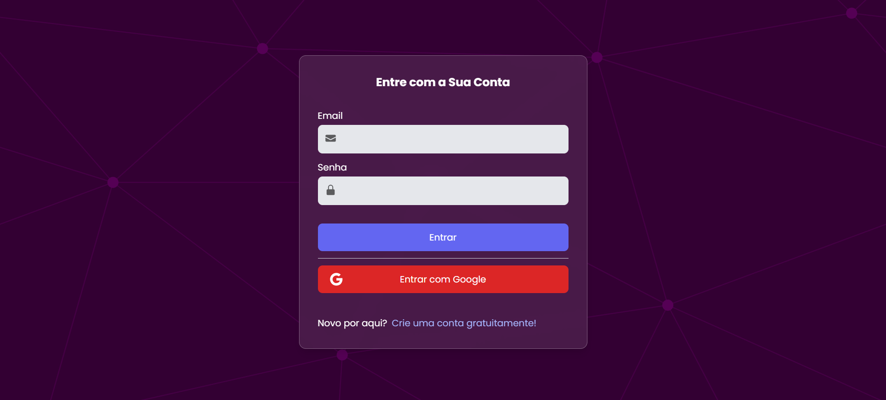
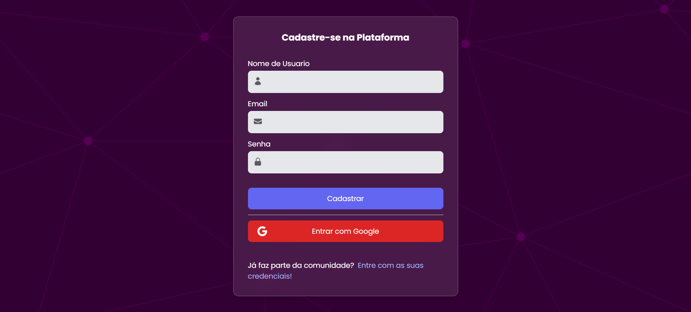
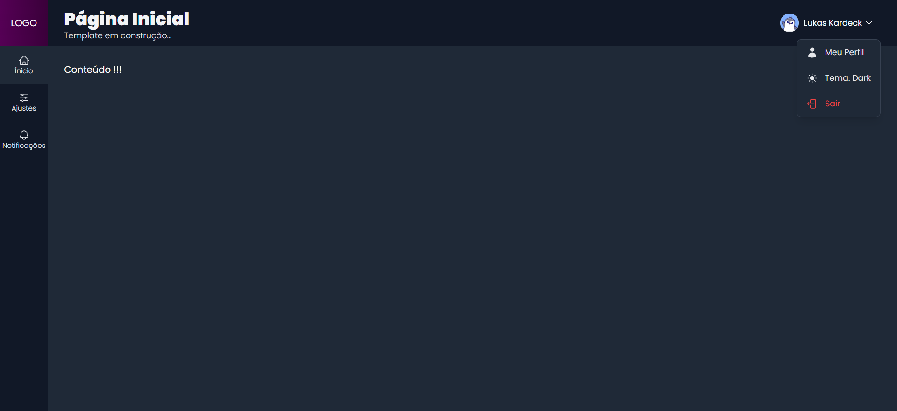

# Next.js Admin Template

Um template de painel administrativo feito em Next.js e React.js, com suporte a autenticação via Firebase, proteção de rotas e gerenciamento de sessão com cookies. Além disso, oferece um layout intuitivo, possui suporte para alternância entre temas claro e escuro e também conta com uma tela de carregamento entre as páginas.

### Telas de Autenticação

 

### Painel Admin
 

## 📌 Funcionalidades

- **Autenticação de usuários** com Firebase (login, cadastro e login via Google);
- **Proteção de rotas** para páginas restritas, garantindo que apenas usuários autenticados acessem áreas específicas;
- **Gerenciamento de cookies** para persistência de autenticação, permitindo que os usuários permaneçam logados mesmo após recarregamentos;
- Alternância entre temas **light** e **dark** para melhor personalização e acessibilidade;

## 💡 Possíveis Aplicações

Por ser um template flexível, este projeto pode ser facilmente adaptado às necessidades específicas de cada aplicação. Ele pode servir como base para **painéis administrativos**, **plataformas de aprendizado** ou **sistemas internos empresariais**. Além disso, é ideal para **dashboards personalizados**, permitindo a exibição de métricas e informações de maneira segura. 

Sua estrutura modular possibilita ajustes rápidos e personalizados, tornando-o uma solução versátil para diversas aplicações web.

Feito por [Lukas Kardeck](https://github.com/lukaskardeck) 🚀 como parte do meu aprendizado no curso de Next.js e React da [COD3R](https://www.cod3r.com.br/).